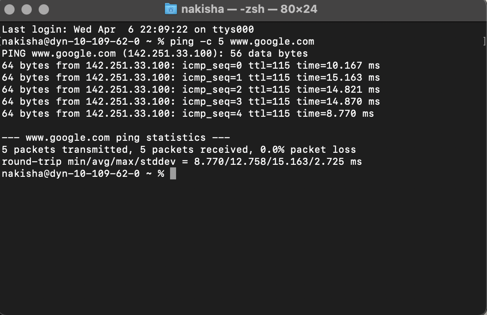
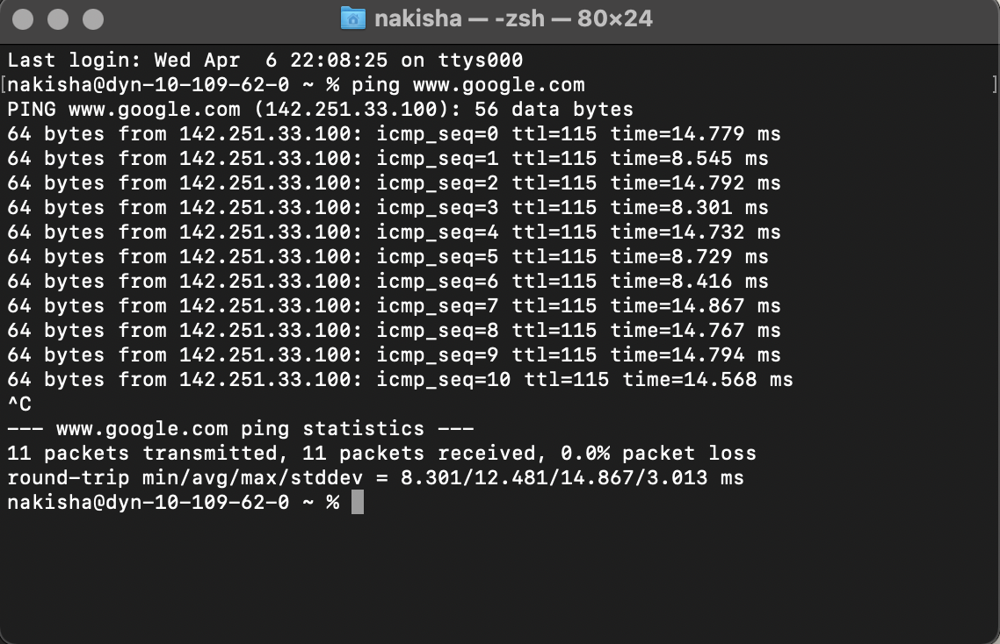

Project 1:

This is the first project that we did for this class. In this project, we get to experiences accessing the local operating system's command line interface. We also get to experience working with CLI commands. As the example, we get to use the commands to create a tree folder. 

We also get to experience ping command. The ping command sends packages to you until you uses a break command ( for mac).

 

Moreover, we also get to practice writing some functions about getting a random string and geting a random day of week.

It was a fun starting for CIT 281
