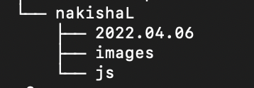

Project 1:

This is the first project that we did for this class. In this project, we get to experiences accessing the local operating system's command line interface. We also get to experience working with CLI commands. As the example, we get to use the commands to create a tree folder. 

